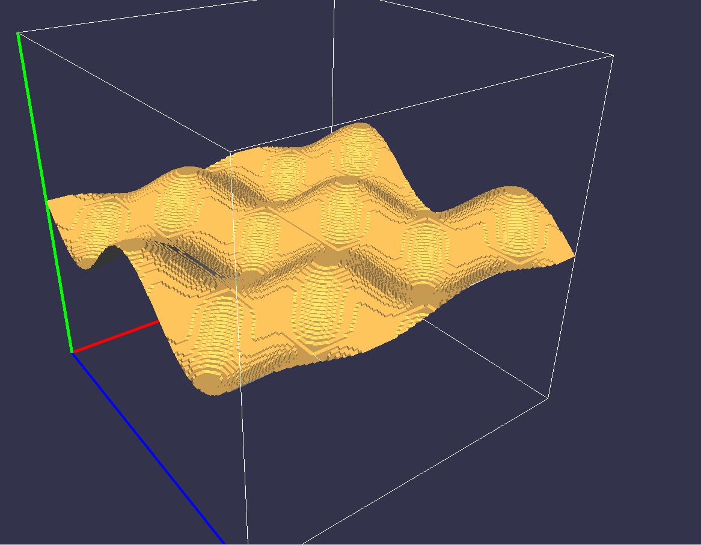
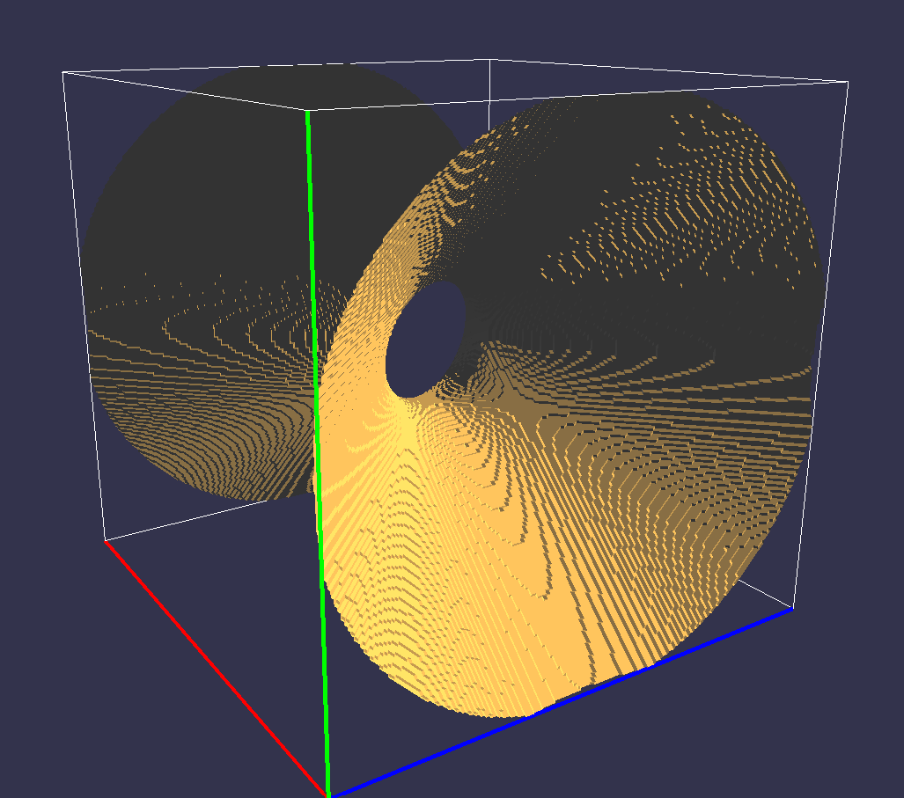

# Marching Cubes with Mesh

## Overview
This project implements the **Marching Cubes Algorithm**, allowing users to generate and manipulate 3D meshes.

## Features
- Click and drag to move the mesh  
- Use Up/Down keys to zoom  
- Adjustable detail with the `stepsize` parameter (default: `0.05` for smooth results)  

## Demo
  
  

## Requirements
- OpenGL  
- GLFW  
- GLM  
- GLEW  
- C++ Compiler (e.g., `g++`)  

## Compilation & Execution
Compile with:
```bash
g++ -o assign5 assign5.cpp -lGL -lGLEW -lglfw
